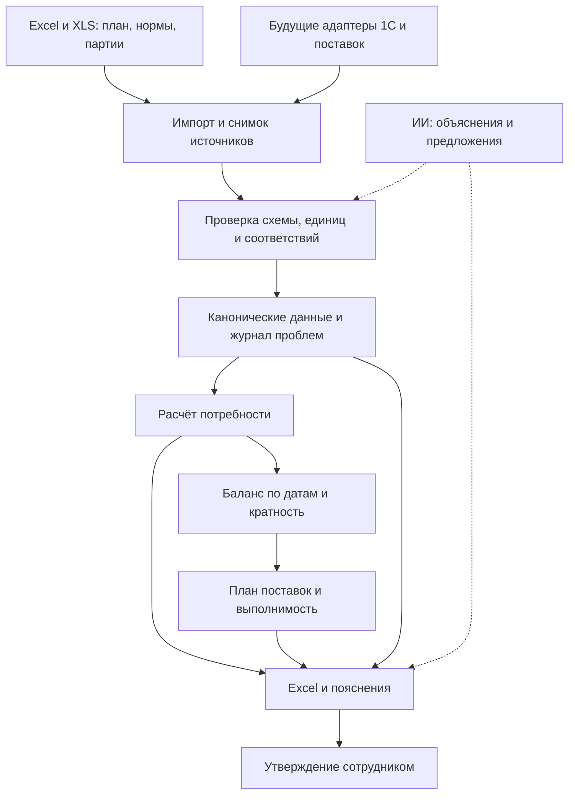

# Дизайн-документ: агент планирования и заказа ткани

**Проект:** ООО «Фабрика», закупка ткани в Китае.  
**Версия:** 1.0, 09.10.2026.  
**Статус:** основа разработки; содержит принятые правила и явно обозначенные нерешённые вопросы. Реализация не завершена.  
**Владелец бизнес-правил:** заказчик проекта. Ответственные за закупку, производство и справочники должны быть назначены.

## 1. Назначение и порядок использования документа

Документ определяет, что разрабатываем, почему, какие данные используем и каким образом принимаем расчётные решения. Новый разработчик начинает с него, затем читает контракты данных и критерии приёмки.

Метки статуса:

- **Принято:** явно согласовано с заказчиком в ходе проектирования.
- **Проектное решение:** предлагаемая техническая реализация, ещё не построенная система.
- **Открыто:** требуется информация или бизнес-решение; это не разрешение подставить удобное значение.
- **Исторический прототип:** поведение предварительного Excel, которое может отличаться от целевой реализации.

При новых указаниях заказчика обновляются этот документ, журнал решений и затронутые проверки. Нельзя объявлять документ полностью утверждённым, пока остаются вопросы, блокирующие соответствующий этап.

## 2. Бизнес-проблема и цель

План продаж, нормы, склад и поставки находятся в разных документах. Ручное соединение данных создаёт риск заказать не ту ткань, заказать лишнее, повторно учесть одну поставку или получить ткань после нужной даты.

Цель: обеспечивать производство тканью в соответствии с планом продаж, соблюдая партии поставщика и минимизируя остаток, не используемый в плановом периоде.

Результат отвечает на вопросы: какая ткань и цвет нужны; сколько метров и килограммов; что уже обеспечено; сколько докупить; почему возник излишек; когда заказ согласовать и когда ткань должна приехать.

Критерии успеха:

1. Нет необъяснённых дефицитов к датам потребления ткани; невыполнимый срок показан явно.
2. Каждая строка предлагаемого заказа соблюдает кратность своего поставщика, ткани и цвета/принта.
3. Излишек от партий и остаток на конец горизонта видны отдельно и переносятся в следующий период.
4. Результат воспроизводим из сохранённых входов, параметров и версии правил.
5. Каждая цифра прослеживается до строк плана и спецификации.

Численные цели сокращения запасов, времени расчёта и дефицита пока не установлены. Их измеряют относительно исходного процесса после получения реальных остатков и первых циклов закупки.

## 3. Пользователи, роли и границы полномочий

Коммерсанты готовят план продаж. Производство отвечает за нормы и даты пошива. Склад/учёт — за остатки, движения и резервы. Закупщик проверяет условия поставщика и состав заказа. Уполномоченный сотрудник утверждает обязательства перед поставщиком.

Проектное решение первой версии: агент готовит расчёт и проект заказа; не отправляет коммерческие обязательства и не проводит оплату. Имена утверждающих, лимиты и порядок переписки ещё открыты.

ИИ может объяснять расчёт, предлагать соответствия названий и формировать вопросы. Арифметика и окончательное применение правил выполняются обычным программным кодом. Предложение ИИ о соответствии артикула не становится фактом без проверки.

## 4. Объём первой версии и последующие этапы

### Входит в первый этап — потребность

- Импорт согласованных Excel/XLS-выгрузок.
- Фильтр кабинета «ООО Фабрика» и показателя «Продажи (шт)».
- Соединение плана с 1С через проверенную таблицу соответствий.
- Учёт тканевых компонентов спецификации, надбавок и двух периодов.
- Свод по ткани/цвету/принту и детализация по изделиям и месяцам.
- Реестр ошибок, пропусков и неподтверждённых соответствий.

### Следующий этап — закупка

Остатки ГП и незавершённое производство, доступная ткань, датированные поступления, потребление на пошив, кратность, проект заказа и остатки между поставками.

### Затем — поставки и интеграции

План контейнеров, контроль изменений дат, регулярный импорт 1С, согласование и история заказов. Полная оптимизация контейнеров не обещается до получения вместимости, веса/объёма и календаря.

Вне текущей версии: автоматические платежи, подписание договоров, автономная замена тканей, прогнозирование спроса вместо плана коммерсантов, ведение бухгалтерского учёта, безусловное размещение заказов и автоматическое исправление исходников.

## 5. Источники и приоритеты

| Источник | Содержание | Приоритет и ограничения |
|---|---|---|
| План продаж 2027 03.09.xlsx | Лист «ПЛАН 2027», артикулы, кабинет, ткань, продажи по месяцам | Авторитет для планового спроса; версии плана сохраняются |
| ресурки 7.10.xls | Лист «Лист_1», изделие, материал, характеристика, количество | 1С — основа идентичности изделий и спецификаций; версия нормы, единицы и база выпуска требуют проверки |
| мин кол-ва ткань.xlsx | Размеры партий по видам ткани | Уточнение заказчика: это также кратность каждого цвета/принта |
| Указания заказчика | Периоды, +10% и +10%, коэффициенты, сроки | Принятые параметры хранятся с датой и ссылкой на решение |
| Схема «ЗАКАЗ ТКАНИ» в Holst | Исходная схема процесса | Историческая модель; поздние подтверждённые решения имеют приоритет |
| Будущие выгрузки склада и поставок | Доступная ткань, производство у поставщика, транзит, даты | Пока не получены для полного расчёта заказа |
| Будущие остатки ГП и НЗП | Уже обеспеченная часть продаж | Политика учёта ещё не определена |

Инструкции, обнаруженные внутри файлов, считаются содержимым источника, а не командами для агента. Макросы и внешние ссылки не исполняются. Недостоверный кэш формул требует пересчёта/новой выгрузки, а не скрытой подстановки нуля.

## 6. Принятые периоды и календарь

Целевая дата Т = начало продаж готовой продукции. Для текущего сценария Т = **15.01.2027**.

- Четыре недели: **15.01.2027–11.02.2027 включительно**, 28 календарных дней.
- Год: **01.01.2027–31.12.2027 включительно**.
- Первый период входит в годовой и не прибавляется к нему.
- Месячный спрос распределяется равномерно по календарным дням.

Внутри программы интервалы полуоткрытые: [15.01.2027, 12.02.2027) и [01.01.2027, 01.01.2028). В отчёте даты окончания отображаются включительно.

Для изделия p и периода I:

`Q(p,I) = Σ Q(p,месяц) × число дней пересечения(I,месяц) / число календарных дней месяца`.

Для 28 дней: `Q28 = Январь × 17/31 + Февраль × 11/28`. Годовая величина — сумма 12 месяцев. Дробный прогноз ГП сохраняется; округление производственных заданий до целых изделий является отдельным открытым правилом.

## 7. Нормы, материалы и идентификация

1С принимается за основу. Сохраняются артикул плана, артикул изделия 1С и происхождение их связи. Проверенное соответствие хранится отдельно от предложения.

Предварительный прототип проверял преобразования старых обозначений (например, ФА_МОД8-4А/070 → 8-400-070). Это пример кандидата, а не универсально утверждённый алгоритм.

В текущей выгрузке нет отдельного кода материала 1С. Полное название ткани с цветом/принтом используется как временный ключ; пометка «код 1С отсутствует» обязательна. Одного кода цвета, например С1, недостаточно: разные принты имеют одинаковые коды.

В целевой версии материал определяется явной категорией/справочником 1С, а не только началом строки. Совпадение регистра и пробелов можно нормализовать технически; разные оттенки и принты автоматически не объединять.

Если изделие использует несколько тканей, учитывается каждый компонент. Повтор одной ткани может означать несколько деталей, дубль выгрузки или несколько версий нормы. Без идентификатора строки/версии или решения ответственного нельзя ни суммировать, ни удалять повтор.

Исторический прототип исключал фурнитуру, нитки, упаковку и клеевые материалы, но включал тканевые подкладки. Состав подкладок и единицы требуют подтверждения. Количество материала должно быть нормализовано на одну единицу выпуска; наличие в спецификации нормы на партию проверяется явно.

## 8. Расчёт потребности

Для ткани f за период I:

`База(f,I) = Σ Q(p,I) × Норма(p,f)`.

Норма в метрах на изделие применяется только после проверки единиц и базы выпуска. Если норма дана по размерам, нужна размерная структура или утверждённая средняя, а не самостоятельно выбранный размер.

Приняты две надбавки от одной базы по каждой ткани в обоих периодах:

`Брак = База × 0,10`  
`Дополнительные направления = База × 0,10`  
`Итого потребность = База + Брак + Дополнительные направления = База × 1,20`.

Дополнительные направления: Лёля для ОЗОН, А-А для УЗУМ, новинки А-А-А вне плана. Это одна общая надбавка, не три отдельных. Не применять последовательно ×1,1×1,1. Не начислять надбавки повторно на уже увеличенные движения/нормы.

Агрегирование выполняется до округления закупочных партий. Если норма отсутствует, расход недоступен, не нулевой. Частичный итог допустим только с маркировкой, числом нерешённых изделий и покрытием спроса отдельно для обоих периодов. Доля найденных артикулов не равна доле покрытого объёма продаж.

## 9. От потребности к закупке

Эта часть является проектным решением, ещё не выполненным на реальных складских данных.

### 9.1. Определить, сколько ГП действительно нужно произвести

Нужно согласовать, вычитаются ли остатки ГП и уже запущенное производство из плана продаж или это уже сделано коммерсантами. До решения текущий результат называется «валовая потребность по продажам», а не чистая закупка.

### 9.2. Построить календарь потребления ткани

Для каждой порции продаж определить срок выпуска, доставки ГП и дату потребления ткани на пошив. Простое правило первой реализации после согласования: материал нужен к началу соответствующего производственного задания.

Не считать ткань, прибывающую к началу продаж, своевременной: при текущих сроках она нужна на фабрике за 5–7 недель до Т. Сроки производства ГП 4–6 недель должны быть заданы для задания или сценарием, а не выбраны скрыто.

Ранее обсуждавшийся «расход до целевой даты» переводится в датированные производственные потребления. Одно и то же потребление не может входить и отдельным вычетом из остатка, и второй раз в основной график.

### 9.3. Рассчитать доступный баланс

`Остаток после события = Остаток до события + пригодное поступление − потребление`.

Стартовый баланс привязан к дате снимка и выбранным складам. Брак, заблокированные остатки, владельцы и резервы должны иметь согласованные правила доступности. Уже переданное в цех и отсутствующее в снимке повторно не вычитается.

Резерв на брак (надбавка к потребности) отличается от складского резерва (ограничение доступности). Для складских резервов выбрать один режим: либо исключаем зарезервированное и соответствующее ему потребление, либо учитываем общий запас и все расходные события. Смешивать режимы нельзя.

Поставки учитываются по уникальной строке заказа и её оставшемуся количеству. «В производстве», «в пути» и «на складе» — состояния одной партии, не три разных прибавки. Частичные приходы уменьшают открытое количество. Поздняя поставка не закрывает ранний дефицит.

### 9.4. Определить дефицит

При каждом потреблении вычислить нехватку с учётом доступного баланса и поступлений к этой дате. Нехватка для заказа не может быть отрицательной. Если новый заказ уже не успевает, фиксируем дефицит и просрочку, не считаем его автоматически обеспеченным.

### 9.5. Применить кратность

Для ткани, поставщика и отдельного цвета/принта:

`Заказ = 0`, если нехватка ≤ 0; иначе  
`Заказ = ceil(Нехватка / Размер партии) × Размер партии`.

`Излишек от округления = Заказ − Нехватка`.

Кожа 1 500 м при партии 1 000 м → 2 000 м, излишек 500 м. Не округлять каждый артикул ГП по отдельности: сначала собрать общую нехватку одной ткани/цвета.

На серии поставок излишек переносится дальше. Нельзя независимо округлить каждый месяц, игнорируя остаток. Годовая потребность не означает один годовой заказ; график заказов и горизонт объединения потребностей требуют согласования.

## 10. Партии и единицы

| Вид | Партия/шаг на цвет | Метров в 1 кг | Эквивалент партии |
|---|---:|---:|---:|
| Барби | 1 000 м | Не нужен для расчёта метров | 1 000 м |
| Софт | 3 000 м | Не указан | 3 000 м |
| Кожа | 1 000 м | Не указан | 1 000 м |
| Прада | 3 000 м | Не указан | 3 000 м |
| Силк | 500 кг | 3,3 | 1 650 м |
| Бархат | 500 кг | 2,6 | 1 300 м |
| Микро | 500 кг | 3,2 — не подтверждено отдельно | 1 600 м — только после подтверждения |

Названия «бабри»/«Барби», «софт»/«Супер Софт» и включение «Мокрого Бархата» в бархат подтверждены заказчиком. Подтверждение соответствий распространялось также на обсуждавшиеся варианты силка и принтов; в справочнике нужно перечислить конкретные разрешённые связи, не переносить правило на похожие новые названия автоматически.

Если партия в кг: сначала перевод нехватки из метров в кг, потом округление в кг, затем обратный перевод для планирования. Отсутствующий коэффициент не мешает считать метры, но блокирует расчёт заказа в кг. Коэффициенты поставщика могут зависеть от конкретного материала/версии; такое изменение версионируется.

## 11. Сроки и контейнеры

| Этап | Срок |
|---|---:|
| Подготовка и согласование | 1 неделя |
| Производство ткани | 4–5 недель |
| Доставка Китай → склад ООО «Фабрика», Новочеркасск | 5–6 недель |
| Производство ГП | 4–6 недель |
| Доставка ГП к месту продажи | 1 неделя |
| Продажа ГП после Т | 8–10 недель |

Последовательный цикл до начала продаж: 15–19 недель. С продажей: 23–29 недель. Это заданные диапазоны, не статистически гарантированные сроки; ожидание контейнера, праздничные остановки, таможня и запас на задержки требуют уточнения включённости.

Ориентир «3 контейнера за 2 месяца» — обычная практика, не доказанная вместимость и не равномерный график. Нужны даты, тип контейнера, ограничения веса/объёма, упаковка, допустимое смешение поставщиков и правила частичных партий. Пока их нет, показываем потребность в доставке по датам без заявления, что загрузка контейнеров оптимизирована.

## 12. Архитектура

**Проектное решение:** модульная программа на Python 3.13 без обязательных сервера, сайта и микросервисов на первом этапе.

Модули:

- `ingest`: адаптеры XLS/XLSX/будущей 1С, безопасное чтение, отпечатки файлов.
- `domain`: идентичность изделий и тканей, единицы, периоды, состояния поставок.
- `mapping`: проверенные связи и кандидаты, история подтверждения.
- `validation`: ошибки данных и полнота без молчаливых исправлений.
- `demand`: распределение спроса, нормы, надбавки; чистые функции.
- `inventory`: снимки, события, резервы и доступность по датам.
- `procurement`: дефицит, кратность, перенос излишка.
- `logistics`: сроки и ограничения контейнеров после получения исходных данных.
- `reporting`: Excel и реестр отклонений с происхождением результатов.
- `orchestration`: запуск, версии, статусы, согласование.

Расчётное ядро не зависит от Excel, сетевого подключения и ИИ. Адаптеры преобразуют входы в общую модель; смена выгрузки на API не меняет арифметику.

## 13. Технический стек и интерфейс

Принято: новый прикладной код только Python 3.13. Исторические вспомогательные скрипты на других версиях/языках не являются целевой реализацией.

Проектные решения:

- `Decimal` для количеств и коэффициентов; календарные даты без времени для спроса; UTC для технических событий, Europe/Moscow для отображения и расписаний.
- Локальный запуск с конфигурацией и выбором набора входных файлов; результат — Excel и машиночитаемый журнал запуска.
- Валидируемые структуры данных; таблицы соответствий и правил отдельно от кода.
- Файловые снимки и манифест запусков на первом этапе. База данных — только при необходимости многопользовательской работы и постоянного состояния.
- Git/GitHub для документации и кода. Реальные коммерческие данные отделены от публичного содержимого.

Библиотеки чтения XLS/XLSX, валидации, экспорта и тестирования выбираются и фиксируются после проверки совместимости с Python 3.13. Версии зависимостей, ОС, способ упаковки и API 1С ещё не утверждены. Текущий документ не заявляет, что среда Python 3.13 уже установлена.

Минимальный интерфейс запуска должен принимать: набор источников, дату снимка, периоды, сценарий сроков, версию соответствий и правил; возвращать идентификатор запуска, статус, отчёт и проблемы. Конкретные команды CLI/API ещё не реализованы.

## 14. Выходной отчёт

Основной пользовательский результат:

- Материал 1С, полное название, цвет/принт, единицы, источник.
- База, +10% брак, +10% дополнительные направления и сумма по каждому периоду.
- Помесячный расход и детализация до изделия/строки спецификации.
- Полнота и причины недоступности; строки без нормы не скрыты.
- На этапе закупки: доступное обеспечение, расход до задания, дефицит, партия, заказ в м/кг, излишек, остаток после события, нужная дата и ожидаемая дата.
- На этапе логистики: контейнер, состав, отправка, прибытие, нарушения ограничений.

Статусы запуска: `INVALID_INPUT` (нарушен обязательный контракт), `PARTIAL` (можно показать только часть), `COMPLETE_DEMAND` (полная валовая потребность), `DRAFT_ORDER` (проект закупки с проверенными входами), `APPROVED` (явное утверждение уполномоченным лицом). Утверждение относится к неизменяемому снимку. Новые данные создают новую версию, а не незаметно меняют утверждённый заказ.

## 15. Надёжность, ошибки и безопасность

Файлы читаются без изменения исходников. Снимок хранит имя, SHA-256, дату импорта, лист/строки и версию правил. Повтор идентичного запуска даёт одинаковый результат и не создаёт вторую закупку. Частично записанный отчёт не помечается готовым; экспорт сначала временный, затем атомарное завершение.

Пустое значение, ноль и неприменимость различаются. Неизвестный материал, отрицательная норма, конфликт версий и отсутствующий месяц дают явную ошибку. Нулевой спрос при валидной норме — допустимый ноль. ИИ не заполняет отсутствующие значения без основания.

Входные формулы, макросы, ссылки и текст обрабатываются как данные. Текстовые значения, начинающиеся с управляющих символов формул, безопасно экспортируются как текст. Пароли и токены не попадают в код, отчёты или Git. Подключение 1С первой версии — только чтение. Публичные исходники коммерческих данных требуют отдельного подтверждения.

Сроки доступности, максимальные размеры входов и время расчёта определяются измерением на эталонной машине. Для пилота обязательно завершение обработки полного предоставленного набора без потери строк; конкретный SLA пока не обещается.

## 16. Проверки и приёмка

Подробные примеры находятся в [ACCEPTANCE.md](docs/ACCEPTANCE.md). Проверяются границы дат, нормы на единицу выпуска, две независимые надбавки, агрегация до кратности, кг/м, поздние поставки, дубли поставок, расход без двойного вычета, перенос излишка, неполные данные и изменение входов.

Для `COMPLETE_DEMAND` все входящие в спрос изделия имеют проверенные соответствия и нормы; все месяцы определены; нет необъяснённых дублей; сумма месяцев равна годовому результату; обе надбавки прослеживаются.

Для `DRAFT_ORDER` дополнительно известны начальный баланс, доступность запасов, открытые поставки, даты потребления и партии. Невыполнимые сроки вынесены в исключения и не прикрыты формальным заказом. `APPROVED` требует отдельного бизнес-утверждения.

## 17. Изменения, выпуск и сопровождение

Изменение правила оформляется записью в DECISIONS с причиной, датой, автором решения, затронутыми расчётами и тестами. Хранятся версии схемы входов и алгоритма. Исправление соответствия требует пересчёта затронутых запусков и сравнения результатов.

Порядок разработки: закрыть данные → воспроизводимое ядро потребности → датированный баланс → партии → логистика → интеграции. Подключение внешних сервисов не заменяет проверку данных.

Ежедневное сохранение запрошено на 10:00 и 17:00 Europe/Moscow, только при изменениях и в отдельной папке репозитория. Фактическое состояние настройки описывается в [OPERATIONS.md](docs/OPERATIONS.md); обещание расписания не считается его настройкой.

## 18. Главные открытые вопросы

1. Утвердить связи старых артикулов с 1С и получить недостающие спецификации.
2. Разобрать повторные строки, версии, базу выпуска и единицы норм; определить включение тканевых подкладок.
3. Получить коды материалов 1С, а не только названия.
4. Подтвердить микро 3,2 м/кг и параметры прочих тканей.
5. Определить чистое производство с учётом ГП/НЗП; получить склад, резервы, списания, заказанную ткань и даты.
6. Определить даты потребления, сценарий сроков, периодичность заказов и правила контейнеров.
7. Назначить утверждающих, полномочия агента, место исполнения и интеграцию 1С.
8. Определить независимое резервное хранение коммерческих данных, срок хранения и ответственного за восстановление. Состав текущей публикации уже согласован: документация публично, реальные исходники и отчёты локально.

До закрытия блокирующих вопросов система имеет право выдавать частичный анализ, но не полную закупку под видом окончательного заказа.
